# Voyage Travel Resilience Engine — Comprehensive Architecture & Deep Context Handover

> **Document Type**: Master Technical Architecture & System Handover Briefing  
> **Target Audience**: Downstream AI Coding Agents, Software Architects, and Full-Stack Engineers  
> **Repository**: `https://github.com/DarkxLucifer/hackcelestial.git` (`main` branch)  
> **Workspace Root**: `d:\project\aiml prime\project\hackcelestial`  

---

## 1. Executive Summary & Core Mission

**Voyage** (codenamed **HackCelestial / Voyage Resilience Engine**) is an autonomous multi-modal travel disruption resolver, cascade domino risk prevention platform, and statutory passenger compensation orchestrator.

### The Problem It Solves
Traditional travel platforms (Google Flights, MakeMyTrip, TripIt) operate in data silos and display passive delay notifications. When a flight is delayed by 45 minutes, they do not tell the traveler:
1. Whether their connecting Vande Bharat train at New Delhi or Central Railway train at Mumbai will be missed.
2. What the statutory cash compensation and meal voucher entitlement is under civil aviation or railway passenger charters.
3. How to immediately rebook or place a contingency "ghost hold" on an alternative multi-modal route (e.g., airport express metro + MSRTC Shivshahi AC bus or premium AC sleeper) before inventory runs out.

### Voyage's Core Capabilities
- **Document Ingestion & Parsing**: Multi-modal vision and heuristic parsing of flight boarding passes, IRCTC e-tickets, MSRTC bus bookings, and hotel vouchers.
- **Topological Cascade Modeling**: Models itineraries as **Spatio-Temporal Directed Acyclic Graphs (TDAG)** using Critical Path Method (CPM) algorithms to detect connection breaches.
- **Real-Time Live Telemetry**: Live Indian Railways tracking via **RailRadar API v1**, real-time flight telemetry via **AviationStack**, and verified bus fleet schedules across **MSRTC** and **redBus/AbhiBus**.
- **Statutory Rights & Compensation Engine**: Real-time evaluation of passenger legal entitlements under **DGCA CAR Section 3 (India)**, **EU261/UK261 (Europe)**, **US DOT 14 CFR Part 259 (USA)**, and **IRCTC TDR Regulations**.
- **Pareto Multi-Objective Recovery Optimizer**: Computes non-dominated recovery alternatives balancing cost, time saved, and traveler comfort (Plan A: Minimum Cost, Plan B: Fastest Recovery, Plan C: Balanced Comfort).
- **Resilient AI Dual-Provider Routing**: Multi-key automatic failover across **Google Gemini (2.5 Flash)**, **Groq (Llama 3.3 70B)**, and a local expert rules engine.

---

## 2. End-to-End System Architecture & Data Flow

```mermaid
flowchart TD
    subgraph ClientLayer ["Frontend (React 18 + Vite + Leaflet)"]
        UI_Home["Landing Hero & Overview"]
        UI_Disrupt["/disruption Disruption Resolver Page"]
        UI_Chat["DisruptionChatbot (AI Assistant & Voice)"]
        UI_Map["CartoJourneyMap (Leaflet + Google Tiles)"]
        UI_Plans["RecoveryPlanCards (Plan A, B, C)"]
        UI_Profile["/profile Nature Canopy & Co-Travellers"]
    end

    subgraph APILayer ["FastAPI Backend (Port 8000)"]
        API_Doc["/api/ai/upload-document<br/>(pypdf + Heuristic + LLM Vision)"]
        API_Chat["/api/ai/chat<br/>(Multi-Key Failover Router)"]
        API_Rail["/api/travel/train-status<br/>/api/travel/train-schedule<br/>/api/travel/pnr-status"]
        API_Flight["/api/travel/flight-status<br/>(AviationStack)"]
        API_Bus["/api/travel/bus-options<br/>(MSRTC & redBus)"]
        API_Rights["/api/disruptions/rights-evaluation<br/>(DGCA / EU261 / IRCTC)"]
        API_Saga["/api/saga/execute-recovery<br/>(Distributed Saga Engine)"]
    end

    subgraph IntelligenceLayer ["Core Computational Engines"]
        ENG_AI["ai_engine.py<br/>(Regex Heuristics + Date/Past Check)"]
        ENG_Graph["graph_engine.py<br/>(TDAG & CPM Slack Calculation)"]
        ENG_Domino["domino_risk.py<br/>(Cascade Disruption Index)"]
        ENG_Opt["optimizer.py<br/>(Pareto Multi-Objective Frontier)"]
        ENG_Rights["rights_engine.py<br/>(Statutory Compensation Rules)"]
        ENG_Saga["saga_orchestrator.py<br/>(Compensating State Machine)"]
    end

    subgraph DataFeeds ["External Real-Time APIs & Feeds"]
        EXT_RailRadar["RailRadar Live API v1<br/>(api.railradar.in)"]
        EXT_Aviation["AviationStack API<br/>(api.aviationstack.com)"]
        EXT_MSRTC["MSRTC ORS & Fleet Matrix<br/>(npublic.msrtcors.com)"]
        EXT_Gemini["Google Gemini 2.5 Flash<br/>(Multi-Key Rotation)"]
        EXT_Groq["Groq Llama 3.3 70B<br/>(Multi-Key Rotation)"]
    end

    subgraph StorageLayer ["Persistence"]
        DB_Sqlite[("SQLite: voyage_disruptions.db<br/>external_disruptions, claims")]
    end

    %% Interactions
    UI_Chat -->|Upload PDF/Image| API_Doc
    UI_Chat -->|User Query| API_Chat
    API_Doc --> ENG_AI
    API_Chat --> ENG_AI
    ENG_AI --> EXT_Gemini
    ENG_AI --> EXT_Groq
    ENG_AI --> EXT_RailRadar
    ENG_AI --> EXT_MSRTC

    API_Doc --> DB_Sqlite
    API_Doc --> UI_Map

    ENG_Graph --> ENG_Domino
    ENG_Domino --> ENG_Opt
    ENG_Opt --> UI_Plans
    ENG_Rights --> API_Rights
    API_Rights --> DB_Sqlite

    API_Rail --> EXT_RailRadar
    API_Flight --> EXT_Aviation
    API_Bus --> EXT_MSRTC
```



---

## 3. Directory Structure & File Manifest

```
d:\project\aiml prime\project\hackcelestial\
├── backend/
│   ├── main.py                 # FastAPI application, static SPA hosting, API endpoints
│   ├── ai_engine.py            # AI document parsing, chat routing, multi-key rotation, KNOWN_LOCATIONS
│   ├── travel_retrieval.py     # Real telemetry: RailRadarTracker, AviationStackTracker, GTFSAndBusRetriever
│   ├── graph_engine.py         # Spatio-Temporal Directed Acyclic Graph (TDAG) & CPM Slack engine
│   ├── domino_risk.py          # Domino Cascade Risk Index computation
│   ├── optimizer.py            # Pareto multi-objective recovery alternatives (Plan A, B, C)
│   ├── rights_engine.py        # Statutory passenger compensation rules (DGCA, EU261, US DOT, IRCTC)
│   ├── database.py             # SQLite persistence layer and claim recording
│   ├── ghost_holds.py          # Contingency booking inventory holds
│   ├── saga_orchestrator.py    # Agentic saga state machine with rollback compensation steps
│   ├── models.py               # Pydantic data schemas & typed contracts
│   └── voyage_disruptions.db   # SQLite relational database
│
├── frontend/
│   ├── src/
│   │   ├── App.jsx             # Root application, tab navigation, global state
│   │   ├── index.css           # Tailwind CSS directives & custom fonts
│   │   ├── main.jsx            # React root mount
│   │   ├── components/
│   │   │   ├── Navbar.jsx          # Top persistent navigation header (z-[100])
│   │   │   ├── Hero.jsx            # Modern landing hero section
│   │   │   ├── CartoJourneyMap.jsx # Interactive Leaflet map with Google tiles, waypoints & polylines
│   │   │   ├── DemoJourneyGraph.jsx# Visual Spatio-Temporal node graph & slack inspector
│   │   │   ├── AgenticSagaModal.jsx# Saga execution animation & confirmation modal
│   │   │   └── Footer.jsx          # Voyage platform footer
│   │   ├── disruption/
│   │   │   ├── DisruptionPage.jsx      # Master Disruption Resolver (/disruption)
│   │   │   ├── DisruptionChatbot.jsx   # AI assistant, document dropzone, voice & structured cards
│   │   │   ├── MultiModalTravelTool.jsx# Standalone flight, rail, bus, and metro telemetry lookup
│   │   │   ├── RecoveryPlanCards.jsx   # Pareto alternative cards (Plan A, B, C)
│   │   │   └── RefundPolicyModal.jsx   # Statutory passenger compensation filing modal
│   │   ├── profile/
│   │   │   └── ProfilePage.jsx         # Nature canopy account page, co-travellers, password reset
│   │   └── booking/
│   │       └── BookingPage.jsx         # User itinerary management
│   ├── dist/                   # Production bundled HTML/CSS/JS (served by FastAPI)
│   ├── package.json            # Node.js dependencies
│   └── vite.config.js          # Vite build configuration & dev proxy
│
├── .env                        # Central environment configuration (API keys, ports, configs)
├── AGENTS.md / GEMINI.md       # Workspace rules & virtual environment standards
└── README.md                   # Project documentation
```

---

## 4. Deep-Dive: Core Subsystems & What Each Does

### 4.1 AI Ingestion & Heuristic Parsing (`backend/ai_engine.py`)
- **Dual Extraction Pipeline**:
  1. **Primary AI Vision / LLM**: Sends document text or image to Gemini 2.5 Flash / Groq Qwen/Llama with a strict JSON extraction schema.
  2. **Heuristic Fallback**: Runs multi-pass regex for PNR, carriers (`IndiGo`, `Air India`, `Indian Railways`), service numbers (`#12810`, `6E 521`), and travel dates.
- **Historical Journey Detection**:
  - Compares the extracted travel date against today's date (`2026-09-27`).
  - Corrects 2-digit years (`26` ➔ `2026`).
  - If the journey occurred in the past (e.g., `2024-09-24`), flags `is_past_journey = True`.
  - Sets operational delay to `0` and marks `journey_status = "COMPLETED"`.
  - Guides the traveler on retrospective IRCTC TDR filing rules rather than triggering active alarms.
- **Location Normalization (`KNOWN_LOCATIONS`)**:
  - Dictionary of 80+ normalized aviation and rail hubs with precise `lat`/`lng` coordinates and aliases.
  - Indian stations include: Panvel (`PNVL`), Vasai Road (`BSR`), Virar, Diva, Belapur CBD, Khopoli, Nagpur (`NGP`), Mumbai CSMT, Mumbai Central (`BCT`), Pune (`PUNE`), Amravati (`AMI`), Bhusaval (`BSL`), Badnera, Akola, Wardha, Jalgaon, Manmad, Nashik Road, Kalyan, Thane, Dadar, Kolhapur (`KOP`), Latur (`LUR`), Sangli (`SNSI`), Miraj (`MRJ`), and Parbhani.
  - Foreign stations are strictly isolated to major international airports with direct flights from India (Zurich, London Heathrow, Dubai, Singapore, JFK, Frankfurt). Swiss mountain villages (`zermatt`, `matterhorn`, `visp`) were removed to prevent false Indian train corridor matches.
- **Multi-Key Failover Engine**:
  - Functions `get_groq_keys()` and `get_gemini_keys()` scan `.env` for comma-separated lists (`GROQ_API_KEYS`, `GEMINI_API_KEYS`) or indexed keys (`GROQ_API_KEY_1`, `GROQ_API_KEY_2`).
  - When making generation or document parsing calls, the engine iterates across all available keys with a fast 8-second timeout per attempt. If one key hits an HTTP 429 rate limit or quota ceiling, it automatically rotates to the next key.

---

### 4.2 Multi-Modal Live Telemetry (`backend/travel_retrieval.py`)
This module aggregates real, authentic travel telemetry with zero mock or synthetic delays:

1. **Indian Railways (`RailRadarTracker`)**:
   - **Base URL**: `https://api.railradar.in/v1`
   - **Auth**: `Authorization: Bearer <RAILRADAR_API_KEY>`
   - **Endpoints**:
     - `GET /v1/trains/{number}/live` — Live running status, delay minutes, current station, upcoming station, speed, distance remaining, and tracking mode.
     - `GET /v1/trains/{number}` — Static schedule and route halts.
     - `GET /v1/pnr/{10_digit_pnr}` — Live IRCTC PNR status and passenger coach/seat booking status.
   - **TDR Eligibility Computation**: Automatically flags `tdr_refund_eligible: true` when delay $\ge 180$ minutes (3 hours).

2. **Aviation Telemetry (`AviationStackTracker`)**:
   - **Base URL**: `http://api.aviationstack.com/v1/flights`
   - **Auth**: `access_key=<AVIATIONSTACK_API_KEY>`
   - Tracks live flight delays, departure/arrival terminals, gates, radar status, altitude, and groundspeed.

3. **Intercity Bus & Urban Transit (`GTFSAndBusRetriever`)**:
   - **MSRTC & Private Fleet Schedules**: Covers major intercity corridors (Kolhapur ➔ Latur, Mumbai ➔ Pune, Nagpur ➔ Mumbai) with verified daily runs:
     - MSRTC Shivshahi AC Seater (₹525, 7h 45m via Sangola/Tuljapur)
     - MSRTC Parivahan / Lal Pari Direct (₹360, 8h 15m via Pandharpur/Barsi)
     - MSRTC State Sleeper (₹610, 8h 00m overnight)
     - Konduskar Travels BharatBenz AC Sleeper (₹750, 7h 30m)
     - Sharma Transports Volvo Multi-Axle Sleeper (₹820, 7h 30m)
   - **Dynamic Systematic Route Generator**: Calculates road distance, duration, standard state transport tariffs, and CBS boarding stands for any Indian city pair.
   - **Delhi Airport Metro Express**: Official GTFS 2.0 schedule (Orange Line connecting IGI Airport Terminal 3 to New Delhi Railway Station in 21 minutes at ₹60 fare).

---

### 4.3 Spatio-Temporal Graph & Cascade Slack Analysis (`backend/graph_engine.py`)
Itineraries are structured as a Spatio-Temporal Directed Acyclic Graph:
$$G = (V, E)$$

- **Nodes ($V$)**: Transport segments (Flight $F_1$, Train $T_1$, Bus $B_1$, Hotel $H_1$). Each node has scheduled departure $D_u$, arrival $A_u$, origin lat/lng, and destination lat/lng.
- **Edges ($E$)**: Transfers connecting node $u$ to node $v$.
- **Slack Buffer Equation**:
  $$\text{Slack}(u, v) = D_v - A_u - \text{MCT}(u, v)$$
  where $\text{MCT}(u, v)$ is the Minimum Connection Time (e.g., 90 minutes for airport-to-rail transfer, 45 minutes for intra-airport, 30 minutes for rail-to-road).
- **Cascade Disruption Condition**:
  An operational delay $\Delta_u$ at node $u$ triggers a cascading failure if:
  $$\Delta_u > \text{Slack}(u, v)$$
  When this condition is met, node $v$ and all subsequent nodes $\{w \mid (v, w) \in E\}$ are marked as **BREACHED (AT RISK)**.

---

### 4.4 Statutory Passenger Rights Legal Engine (`backend/rights_engine.py`)
Computes precise legal compensation and refund entitlements based on statutory regulatory frameworks:

| Jurisdiction | Regulatory Law | Delay Threshold | Entitlement |
|---|---|---|---|
| **India (Aviation)** | DGCA CAR Section 3, Series M, Part IV | $\ge 2\text{ hours}$ | Free refreshments & meals at departure terminal |
| **India (Aviation)** | DGCA CAR Section 3, Series M, Part IV | $\ge 4\text{ hours}$ | Full 100% cash refund without cancellation deductions |
| **India (Aviation)** | DGCA CAR Section 3, Series M, Part IV | Cancellation / Missed connection | ₹5,000 to ₹10,000 statutory compensation + rebooking |
| **India (Railways)** | IRCTC Passenger Charter & TDR Rules | $\ge 3\text{ hours}$ at boarding station | 100% full refund via online TDR filing with zero penalty |
| **Europe** | EU Regulation 261/2004 | $\ge 3\text{ hours}$ arrival | €250 (< 1,500 km), €400 (1,500–3,500 km), €600 (> 3,500 km) |
| **United States** | US DOT 14 CFR Part 259 | Significant schedule change / cancellation | Mandatory full refund in original payment form |

---

### 4.5 Pareto Multi-Objective Recovery Optimizer (`backend/optimizer.py`)
When a disruption occurs, the optimizer computes the Pareto frontier across three objectives:
1. $\min(\text{Cost})$ — Additional out-of-pocket expenditure.
2. $\min(\text{Arrival Delay})$ — Total time lost reaching final destination.
3. $\max(\text{Comfort})$ — Transit modality comfort rating (Air > AC Sleeper > Ordinary Seater).

This yields three distinct, non-dominated recovery alternatives:
- **Plan A: Budget Recovery (Minimum Cost)**: Rebooking on the next scheduled carrier service at zero extra cost, statutory terminal meal vouchers, downstream hotel notice dispatched.
- **Plan B: Fastest Recovery (Minimum Time Loss)**: Alternative flight + express connection arriving tonight with 9h+ saved.
- **Plan C: Balanced Multi-Modal Recovery**: High-speed rail / Volvo AC sleeper transit maintaining downstream schedule integrity.

---

### 4.6 Frontend Architecture & UI/UX Design System

#### Color Palette & Styling Tokens
- **Background**: `#FAF9F6` (Warm off-white)
- **Primary Navy**: `#181E4B` (Headers, brand elements, primary buttons)
- **Accent Coral**: `#DF6951` (Disruption alerts, primary action highlights)
- **Dark Pine**: `#072422` (Nature canopy banner on Profile Page)
- **Light Peach / Warm Cream**: `#FFF1DA` (Icon container badges)
- **Status Badges**: Clean white styling (`bg-white text-slate-800 border border-slate-300 shadow-2xs`) replacing harsh green/red backgrounds.

#### Interactive Map (`CartoJourneyMap.jsx`)
- Built on **Leaflet.js** with multiple basemaps: Google Roadmap, Google Satellite, Google Terrain, Carto Voyager, and Carto Positron.
- Renders dynamic SVG pins for Airports (Plane icon), Railway Stations (Train icon), and Bus Terminals (Bus icon).
- Draws animated connecting polylines:
  - Solid Navy: On-schedule segments
  - Dashed Amber: Delayed segments
  - Dotted Coral: Recommended recovery paths
- **"Clear Ticket Session"**: Completely wipes markers, polylines, and cached records, resetting the map to an India center with `"Map Ready • No active ticket markings"`.

#### AI Disruption Chatbot (`DisruptionChatbot.jsx`)
- Floating modal with smooth minimize/maximize, voice recognition (Web Speech API), and file dropzone.
- **No Synthetic Injections**: Never invents fake flights or delays.
- **Structured Interactive Bus Cards**: Displays verified bus departures with operator badges, timings, boarding/drop stands, fares, and direct booking links.
- **Departure Time Inquiry Chips**: Interactive filters for 🌅 Morning (06:00–12:00), ☀️ Afternoon (12:00–18:00), 🌙 Night Sleeper (18:00+), and 💰 Lowest Fare.

---

## 5. Walkthrough of Typical User Scenarios

### Scenario A: Uploading a Past Journey Ticket (Nagpur ➔ Mumbai CSMT)
1. **User Action**: Drags a PDF ticket for train `#12810 Howrah - Mumbai CSMT Mail` dated `24-Sep-2024`.
2. **AI Processing**:
   - `ai_engine.py` extracts travel date `2024-09-24`.
   - Checks against current date `2026-09-27` ➔ Flags `is_past_journey = True`.
   - Sets `delay_minutes = 0`, `status = "Historical Journey (Completed Run)"`.
3. **UI Rendering**:
   - Chatbot displays: `"Travel Status: ✅ Historical Journey — Service Already Completed"`.
   - Badge displays: `"PAST TRIP (COMPLETED)"`.
   - Map draws the corridor without disruption warnings.
   - Recovery Plans section is **hidden** because no active disruption exists.

### Scenario B: Live Train Telemetry Query ("search about 12134")
1. **User Action**: Types `"search about 12134"` into the chatbot.
2. **Backend Processing**:
   - Regex matches 5-digit number `12134`.
   - Calls `RailRadarTracker.get_live_train_status("12134")`.
   - Retrieves live data: `Mumbai CSMT SF Express`, route `Mangalore Jn ➔ Mumbai CSMT`, currently approaching `Sindhudurg`, delay `+115 mins`, next halt `Kankavli`.
   - Injects real live telemetry into the prompt and returns `structured_ticket`.
3. **UI Rendering**:
   - Chatbot replies with accurate real-time location, speed, and delay.
   - Renders verified live card: `Indian Railways (#12134 Mumbai CSMT SF Express)` from `Mangalore Jn ➔ Mumbai CSMT` with `+115m DELAY`.

### Scenario C: Intercity Bus Search ("kolhapur to latur search travels")
1. **User Action**: Types `"kolhapur to latur search travels"`.
2. **Backend Processing**:
   - Regex extracts origin `"Kolhapur"` and destination `"Latur"`.
   - Calls `GTFSAndBusRetriever.search_intercity_buses("Kolhapur", "Latur")`.
   - Returns 6 verified services (MSRTC Shivshahi AC, MSRTC Parivahan, Konduskar Travels, Sharma Transports) with exact timings and fares.
3. **UI Rendering**:
   - Chatbot presents markdown table + structured interactive card.
   - Interactive time chips appear: 🌅 Morning, ☀️ Afternoon, 🌙 Night Sleeper, 💰 Lowest Fare.
   - Each service has a direct `Book` button linking to `npublic.msrtcors.com` or `redbus.in`.

---

## 6. Database Schema (`backend/voyage_disruptions.db`)

SQLite database managed via `backend/database.py`:

```sql
-- Active and parsed disruptions
CREATE TABLE IF NOT EXISTS external_disruptions (
    id INTEGER PRIMARY KEY AUTOINCREMENT,
    pnr TEXT UNIQUE,
    carrier TEXT NOT NULL,
    service_number TEXT NOT NULL,
    origin TEXT NOT NULL,
    destination TEXT NOT NULL,
    travel_date TEXT,
    is_past_journey INTEGER DEFAULT 0,
    delay_minutes INTEGER DEFAULT 0,
    is_cancellation INTEGER DEFAULT 0,
    ticket_cost REAL DEFAULT 0.0,
    currency TEXT DEFAULT 'INR',
    disruption_reason TEXT,
    created_at TIMESTAMP DEFAULT CURRENT_TIMESTAMP
);

-- Passenger statutory refund & compensation claims
CREATE TABLE IF NOT EXISTS statutory_claims (
    claim_id TEXT PRIMARY KEY,
    pnr TEXT NOT NULL,
    carrier TEXT NOT NULL,
    applicable_law TEXT NOT NULL,
    refund_amount REAL NOT NULL,
    statutory_compensation REAL NOT NULL,
    total_claim_amount REAL NOT NULL,
    status TEXT DEFAULT 'SUBMITTED',
    filed_at TIMESTAMP DEFAULT CURRENT_TIMESTAMP,
    FOREIGN KEY(pnr) REFERENCES external_disruptions(pnr)
);
```

---

## 7. Configuration & Environment Variables (`.env`)

```ini
# 1. MAPS & GEOSPATIAL
VITE_CARTO_API_KEY=your_carto_basemaps_api_key

# 2. AI DUAL-PROVIDER (GROQ + GEMINI WITH MULTI-KEY FAILOVER)
# Support single key, comma-separated keys, or numbered keys (GROQ_API_KEY_1, GROQ_API_KEY_2)
GROQ_API_KEY=gsk_your_primary_groq_key_here
# GROQ_API_KEYS=gsk_key1,gsk_key2,gsk_key3
# GROQ_API_KEY_2=gsk_backup_key_here

# Google Gemini API Keys: Gemini 2.5 Flash / 2.0 Flash
GEMINI_API_KEY=AIzaSy_your_primary_gemini_key_here
# GEMINI_API_KEYS=AIzaSy_key1,AIzaSy_key2
# GEMINI_API_KEY_2=AIzaSy_backup_key_here

# 3. FLIGHT TELEMETRY
AVIATIONSTACK_API_KEY=your_aviationstack_access_key

# 4. TRAIN TELEMETRY
RAILRADAR_API_KEY=rg_your_railradar_api_token

# 5. BUS & ROAD RECOVERY
REDBUS_API_KEY=
ABHIBUS_API_KEY=

# 6. URBAN TRANSIT (GTFS 2.0 FEEDS)
GTFS_STATIC_FEED_URL=https://openmobilitydata.org/
```

---

## 8. Operational & Deployment Commands

### Python Environment Rules
- Always use the dedicated virtual environment at `D:\project\aiml prime\.venv`.
- Python Executable: `D:\project\aiml prime\.venv\Scripts\python.exe`.
- Always use `uv` for package management and script execution.

```powershell
# Run backend server (FastAPI on Port 8000)
& "D:\project\aiml prime\.venv\Scripts\python.exe" -m uvicorn backend.main:app --host 127.0.0.1 --port 8000 --reload

# Run frontend development server (Vite on Port 5173)
cd "d:\project\aiml prime\project\hackcelestial\frontend"
npm run dev

# Build frontend production bundle (Serves statically via FastAPI /)
cd "d:\project\aiml prime\project\hackcelestial\frontend"
npm run build

# Git synchronization
cd "d:\project\aiml prime\project\hackcelestial"
git status
git add -A
git commit -m "feat/fix message"
git push origin main
```

---

## 9. Recent Key Fixes & Known Gotchas

1. **Ghost Disruption Bug (Fixed in commit `17a8845`)**:
   - In `DisruptionChatbot.jsx`, an old client-side interceptor was creating fake `Indian Railways (AI 882) +210m DELAY Mumbai ➔ Delhi` records whenever the user chatted about trains.
   - This has been removed. The chatbot now only displays structured cards for verified RailRadar queries or user-uploaded tickets.
2. **Swiss Station Collision (Fixed in commit `f7aece1`)**:
   - `KNOWN_LOCATIONS` contained `"zermatt"` and `"visp"`, causing tickets like `Panvel ➔ Nagpur` to map to `Panvel ➔ Zermatt`. All non-aviation European locations were removed and 16 Indian stations were added.
3. **RailRadar Subdomain (Fixed in commit `5152b48`)**:
   - Correct base URL is `https://api.railradar.in/v1`, not `railradar.in/api/v1`. Bearer authentication is required.
4. **Fast Multi-Key Failover (Implemented in commit `7d83d4a`)**:
   - Candidate models are optimized to `gemini-2.5-flash` and `llama-3.3-70b-versatile` with an 8s timeout to guarantee rapid responses.
