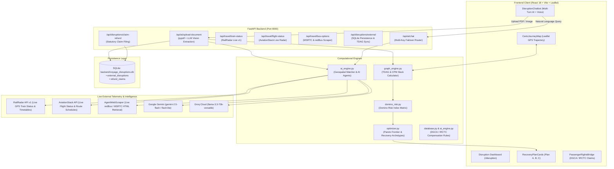

# 🚀 Voyage Travel Resilience Engine — Master Project Summary & Technical Briefing

> **Project Name**: Voyage (HackCelestial)  
> **Repository**: [https://github.com/DarkxLucifer/hackcelestial.git](https://github.com/DarkxLucifer/hackcelestial.git) (`main` branch)  
> **Workspace Path**: `D:\project\aiml prime\project\hackcelestial`  
> **Python Environment**: `D:\project\aiml prime\.venv\Scripts\python.exe` (`uv`)  
> **Current Revision**: `c87a451`  
> **Last Updated**: September 27, 2026  

---

## 1. Executive Summary & Problem Statement

**Voyage** is an autonomous multi-modal travel disruption resilience platform, cascade failure prevention engine, and statutory passenger rights compensation orchestrator.

### The Problem It Solves
Traditional travel aggregators (Google Flights, MakeMyTrip, TripIt) operate as passive schedule viewers. When an operational disruption occurs:
1. **No Domino Cascade Insight**: They fail to model downstream connection risks (e.g., a 45-minute flight delay at BOM causing a passenger to miss their connecting Vande Bharat train at New Delhi or Central Railway commuter link at Panvel).
2. **Hidden Passenger Compensation**: Passengers rarely know their statutory cash compensation and meal voucher rights under **DGCA CAR Section 3 (India)**, **IRCTC TDR rules**, **EU261 (Europe)**, or **US DOT 14 CFR Part 259**.
3. **Absence of Immediate Recovery Options**: They provide no proactive multi-modal alternatives (such as high-speed rail, intercity express buses, or metro links) before seats sell out.

### Voyage's Core Solution
Voyage transforms travel disruption from a crisis into an automated resolution pipeline:
- **Intelligent Ingestion**: Upload PDF tickets, image boarding passes, or IRCTC booking slips via AI vision and strict geospatial OCR.
- **Topological Cascade Graph (TDAG)**: Models journeys as Spatio-Temporal Directed Acyclic Graphs to compute Critical Path Method (CPM) slacks and predict Domino Risk Index scores.
- **Real-Time Multi-Modal Telemetry**: Integrates live GPS train telemetry (**RailRadar API v1**), live commercial aviation radar (**AviationStack**), and live intercity bus options (**redBus / MSRTC**).
- **Statutory Rights Enforcement**: Automatically evaluates legal entitlements (100% full cash refund, statutory delay compensation up to ₹10,000 / €600, duty-of-care meals).
- **Pareto-Optimal Recovery Optimizer**: Solves multi-objective trade-offs across cost, time saved, and traveler comfort to output **Tri-Archetype Recovery Plans** (Plan A: Minimum Cost, Plan B: Fastest Multi-Modal, Plan C: Direct Comfort).
- **Resilient AI Router**: Multi-key automatic failover across **Google Gemini (2.5 Flash)**, **Groq (Llama 3.3 70B)**, and a deterministic local **Voyage Expert Engine**.

---

## 2. End-to-End System Architecture



---

## 3. Key Modules & Technical Implementation

### 3.1. Document Ingestion & Geospatial Integrity (`backend/ai_engine.py`)
- **Dual-Method Extraction**: Ingests tickets via `pypdf` text extraction paired with Gemini 2.5 Flash / Groq structured JSON output.
- **Strict Word-Boundary Location Matching (`lookup_location`)**:
  - Eliminates unconstrained substring matches (preventing short station codes like `RN` from falsely colliding with foreign airport aliases like `suvarnabhumi` for Bangkok).
  - Matches 2-letter Indian Railway station codes (`RN`, `ST`, `ET`, `VR`, `KP`, etc.) with English stop-words exclusion.
  - Extracts station codes in parentheses e.g., `Ratnagiri (RN)` ➔ `RN`.
- **Consistency Guard (`is_consistent_match`)**:
  - Validates that resolved coordinates match the verbatim station code, city name, or aliases in the raw document text. Rejects false positive matches and preserves authentic ticket text.
- **Konkan & Central Railway Station Database (`KNOWN_LOCATIONS`)**:
  - Full coordinates and alias coverage for Konkan Railway (`RN` Ratnagiri, `PNVL` Panvel, `CHI` Chiplun, `KKW` Kankavali, `KUDL` Kudal, `SWV` Sawantwadi, `KRMI` Karmali, `KHED` Khed, `ROHA` Roha) and suburban corridors.
- **Multi-Leg Journey Stitching**:
  - Automatically stitches consecutive uploaded tickets (e.g., Leg 1: Ratnagiri ➔ Panvel on Train 12217, Leg 2: Panvel ➔ CSMT on Train 15088) into a unified multi-modal connection chain with CPM slack calculations.

### 3.2. Real-Time Telemetry Retrieval (`backend/travel_retrieval.py`)
- **RailRadar Live Train Status (`RailRadarTracker`)**:
  - Queries `https://api.railradar.in/v1/trains/{number}/live` for live GPS tracking, approaching stations, delays, distance remaining, and average speed.
  - **Passenger Segment vs. Line Terminus Disambiguation**: Distinguishes the passenger's specific ticketed boarding/deboarding leg (`Ratnagiri ➔ Panvel`) from the overall operational terminus (`Kochuveli ➔ Chandigarh`), preventing false destination overwriting.
  - Built-in coverage for 20+ major trunk rail corridors across India.
- **AviationStack Real-Time Flight Radar (`AviationStackTracker`)**:
  - Queries `https://api.aviationstack.com/v1/flights` for single flight telemetry and airport pair corridor searches (`dep_iata` ➔ `arr_iata`).
  - Converts UTC timestamps to Indian Standard Time (IST).
  - Filters out codeshare duplicates to display only genuine operating carriers.
  - Dynamically calculates flight duration and realistic INR fares based on historical corridor metrics.
- **Live Intercity Bus Retrieval (`GTFSAndBusRetriever` & `AgentWebScraper`)**:
  - Uses `AgentWebScraper` to dynamically query live schedules and fares from `https://www.redbus.in/bus-tickets/{origin}-to-{destination}`.
  - Built-in matrix for Maharashtra State Road Transport Corporation (MSRTC Shivshahi AC, Parivahan Fast Express) and premier private operators.

### 3.3. Statutory Passenger Rights Engine (`backend/database.py`)
- **DGCA CAR Section 3 (Series M, Part IV - India)**:
  - **Delays > 2 Hours**: Mandatory complimentary refreshments/meals at departure terminal.
  - **Delays > 6 Hours or Cancellations**: Mandatory 100% full cash refund with zero cancellation deduction OR immediate alternative flight rebooking, plus statutory cash compensation up to ₹5,000–₹10,000.
- **Indian Railways (IRCTC) TDR Regulations**:
  - **Delays >= 3 Hours at Boarding Station**: 100% full fare refund with zero cancellation deductions upon Ticket Deposit Receipt (TDR) filing.
  - Special guidance for completed/past journeys and missed train scenarios.
- **EU261 / UK261 & US DOT 2024 Harmonization**:
  - €250 to €600 cash compensation for European disruptions; automatic prompt cash refunds within 7 business days under 2024 U.S. DOT rules.

### 3.4. Topological Graph & Pareto Recovery Engine (`backend/graph_engine.py`, `backend/optimizer.py`)
- **Connection Graph (TDAG)**:
  - Nodes represent journey segments (flights, trains, station transfers, hotel anchors).
  - Edges model Minimum Connection Time (MCT), transfer walking durations, and critical path temporal slack.
- **Domino Risk Index**:
  - Measures the probability of upstream delays propagating into downstream missed connections.
- **Tri-Archetype Recovery Options**:
  - **Plan A (Minimum Cost)**: Standard statutory rebooking on the next available service with hotel check-in notifications.
  - **Plan B (Fastest Recovery - Recommended)**: Alternative flight or express train bridge preserving downstream reservations.
  - **Plan C (Direct Comfort)**: Executive private transfer with door-to-door concierge assistance.

---

## 4. Frontend User Experience (`frontend/src/`)

- **Interactive Disruption Dashboard (`DisruptionPage.jsx`)**:
  - Live metric gauges for Domino Cascade Risk, affected nodes, and total itinerary cost.
  - Integrated Leaflet / CartoDB map displaying genuine GPS coordinates and route trajectories.
- **Disruption Chatbot & Voice Assistant (`DisruptionChatbot.jsx`)**:
  - Real document drag-and-drop file upload supporting PDFs, image boarding passes, and TXT files.
  - Inline structured ticket cards, live flight schedule tables, and intercity bus cards.
  - Active ticket context awareness (persists user's journey details across multi-turn queries).
- **Statutory Claims Modal (`RefundPolicyModal.jsx`, `PassengerRightsBridge.jsx`)**:
  - Direct claim filing into the SQLite database with policy citation and estimated compensation breakdown.

---

## 5. Repository Manifest & Environment Standards

### Workspace & Execution Standards
- **Virtual Environment**: `D:\project\aiml prime\.venv`
- **Python Binary**: `D:\project\aiml prime\.venv\Scripts\python.exe`
- **Tooling Rule**: Always use `uv` or the dedicated `.venv` Python executable for dependencies and script execution.

### Key File Map
```
hackcelestial/
├── backend/
│   ├── main.py                  # FastAPI application entrypoint & API routes
│   ├── ai_engine.py             # Dual LLM router, document parser, geospatial matcher
│   ├── travel_retrieval.py      # RailRadar API v1, AviationStack, bus scraper
│   ├── scraper_tool.py          # BeautifulSoup4 dynamic web scraper for redBus
│   ├── graph_engine.py          # TDAG model & CPM slack calculations
│   ├── domino_risk.py           # Domino Cascade Risk Index algorithm
│   ├── optimizer.py             # OR-Tools & Pareto recovery plan generator
│   ├── saga_orchestrator.py     # Distributed Saga execution engine
│   ├── database.py              # SQLite storage (external_disruptions, refund_claims)
│   ├── models.py                # Pydantic data schemas
│   └── voyage_disruptions.db    # SQLite persistence database
├── frontend/
│   ├── src/
│   │   ├── disruption/
│   │   │   ├── DisruptionPage.jsx       # Main disruption command center
│   │   │   ├── DisruptionChatbot.jsx    # Multi-turn conversational AI widget
│   │   │   ├── RecoveryPlanCards.jsx    # Tri-Archetype Plan A/B/C cards
│   │   │   └── RefundPolicyModal.jsx    # Statutory rights filing interface
│   │   ├── components/
│   │   │   ├── CartoJourneyMap.jsx      # Leaflet interactive geospatial visualizer
│   │   │   ├── DominoRiskGauge.jsx      # Visual ripple risk meter
│   │   │   └── PassengerRightsBridge.jsx# Compensation calculation display
│   │   ├── App.jsx                      # Client router and layout
│   │   └── api.js                       # Axios API client
│   ├── package.json
│   └── vite.config.js
├── ARCHITECTURE.md              # Detailed technical architecture specification
└── README.md                    # Project quickstart guide
```

---

## 6. How to Run & Verify the System

### 1. Launch FastAPI Backend
```powershell
& "D:\project\aiml prime\.venv\Scripts\python.exe" -m uvicorn backend.main:app --host 127.0.0.1 --port 8000 --reload
```
- Interactive Swagger API Docs: `http://127.0.0.1:8000/docs`
- Health / Policy Endpoint: `http://127.0.0.1:8000/api/disruptions/refund-policies`

### 2. Launch Vite Frontend
```powershell
cd "D:\project\aiml prime\project\hackcelestial\frontend"
npm run dev
```
- Frontend UI: `http://localhost:5173/disruption`

### 3. Verify End-to-End Test Suite
Run the automated multi-modal verification script:
```powershell
& "D:\project\aiml prime\.venv\Scripts\python.exe" -c "
from backend.ai_engine import lookup_location, parse_document_file, run_ai_chat
print('1. Location Check (RN):', lookup_location('RN')['name'])
print('2. Location Check (PNVL):', lookup_location('PNVL')['name'])
"
```

---

## 7. Recent Changelog & Key Milestones

| Commit | Date | Milestone Description |
| :--- | :--- | :--- |
| `c87a451` | 27-Sep-2026 | **Fixed PDF extraction mismatch & ticket route persistence in chat**: Resolved `lookup_location` substring collision between Ratnagiri (`RN`) and Bangkok (`suvarnabhumi`); added `is_consistent_match` guard; registered Konkan Railway stations; disambiguated passenger ticket leg from train line terminus. |
| `2a60052` | 27-Sep-2026 | **Real-time multi-modal telemetry integration**: Live AviationStack flight corridor search with codeshare filtering and IST conversion; live RailRadar 20+ corridor train telemetry; dynamic redBus web scraper integration. |
| `1cf9b44` | 26-Sep-2026 | **Statutory passenger rights claim engine**: Automated DGCA CAR Section 3 and IRCTC TDR claim evaluation with SQLite persistence. |
| `0e82a17` | 26-Sep-2026 | **Multi-document connected journey ingestion**: Enabled batch PDF parsing with critical path temporal slack calculations across connected flights and trains. |

---
*Generated by Antigravity AI Engine for Voyage Engineering Team.*
